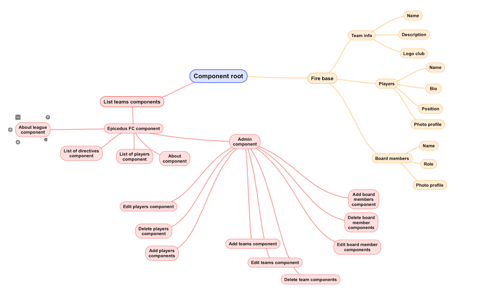
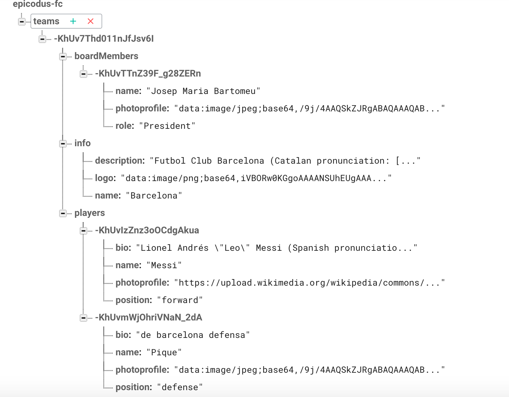

# 

### By Félix Oporto

## Description		

**Soccer-League-Manager** is a web app league manager that allows to generate teams with information about players and board-members. It has being build with the purpose of demonstrating the use of **Angular 2 JavaScript Framework** which use **TypeScript** open-source programming language.


## Installation

Step 1: **Clone this repository**

Step 2: **Install npm and bower**

```console
npm install
```

Step 3: **Run the serve in the console**

```console
ng s
```

Step 4: **In your browser type:**
```browser
localhost:4200
```

## Technologies Used
* JavaScript
* Angular 2
* Node.js
* TypeScript
* Bower
* Gulp
* Bootstrap
* HTML
* CSS

## Planning

1. Production

* Create project directory using Angular CLI.
```console
ng new Soccer-League-Manager
```

* Create new components.
```console
ng generate component add-team
etc
```

# 

* Seed Database.

# 


2. UX/UI
  * Add bootstrap.

3. Polish
  * Make README awesome


## Support and contact details		

Please direct questions  to the author:		
* felixop8@gmail.com

## Known Bugs
No known bugs.

## License		
MIT Commons		
Copyright (c) 2017 Felix Oporto Lopez.
